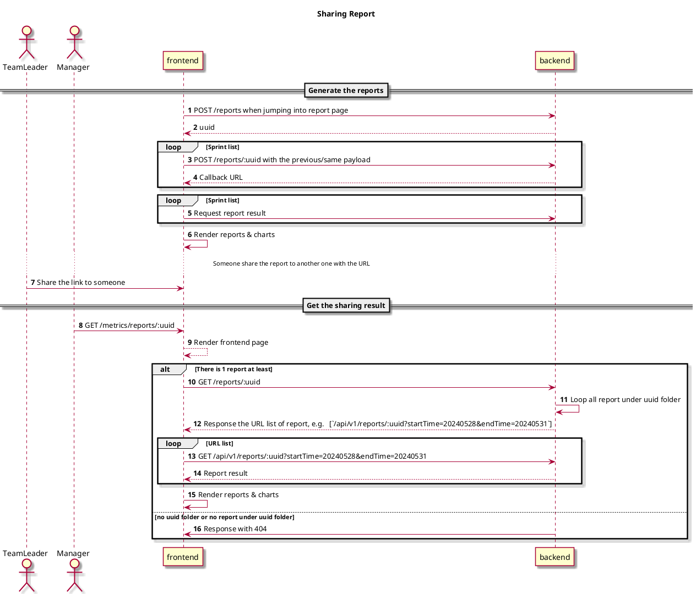

## Background

It is a bit difficult to get the final report for some users, they just want to see the report, do not want to store/upload the config file for our app. it is reasonable for the product.

Our target is to re-design the arch to match the user's requirement.

## Scopes

- Frontend
- Backend

## Design

### Frontend

|Item|New|Note|
|:--|:--|:--|
|Router|`/metrics/reports/:uuid`|Sharing dashboard|
:::note[limitations]
Define the routers ref [here](https://reactrouter.com/en/main/start/concepts#defining-routes)
:::

### Backend



#### New file/folder tree

```sh
app/output/reports
  -- uuid
    -- [startDatetime]-[endDatetime]-[timestamp].csv
````

:::note[Need actions]
- Update the logic of deleting the existing report
:::

## Tasks

- Refactor with the RESTFul API in the backend
  - [new]    POST `/reports` return UUID
  - [upadte] POST `/reports/:uuid` return callback URL
  - [update] GET  `/reports/:uuid?startTime=20240528&endTime=20240531`
  - [new]    GET  `/reports/:uuid` return callback URL list
  - [udpate] GET  `/reports/:type/:uuid` download reports
  - Update the logic of deleting the existing report
    - Delete in the 7 days in the backend
- Add new route in the frontend and implatement the sharing dashboard
  - Route: `/metrics/reports/:uuid`
  - Page: Sharing dashboard
  - Page: 404
  - Show 1 day to delete

## Decision
